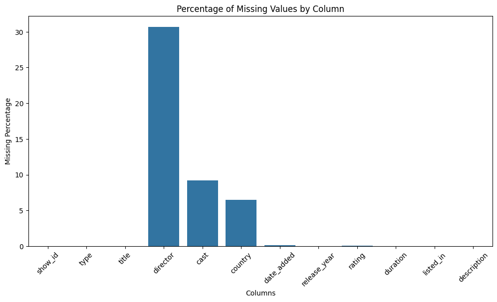
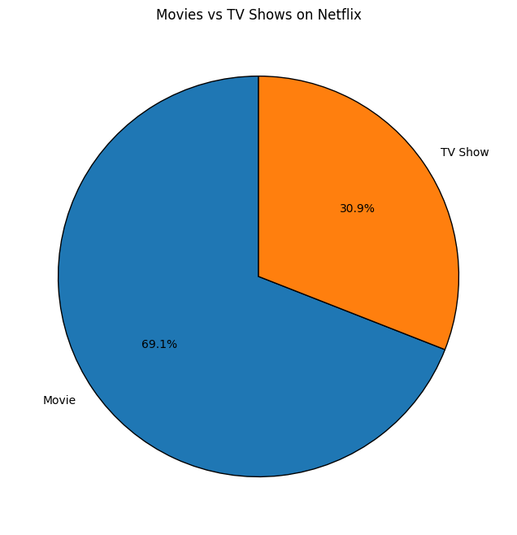
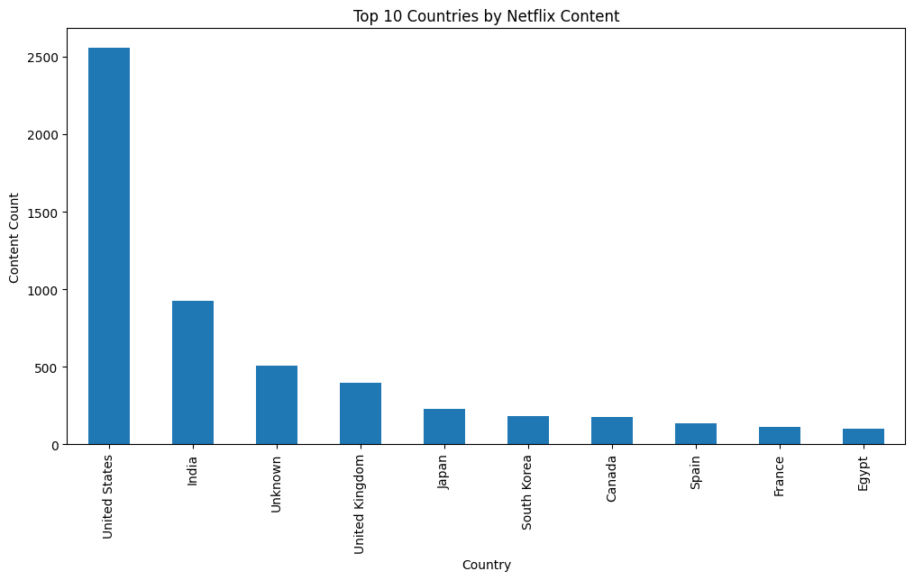
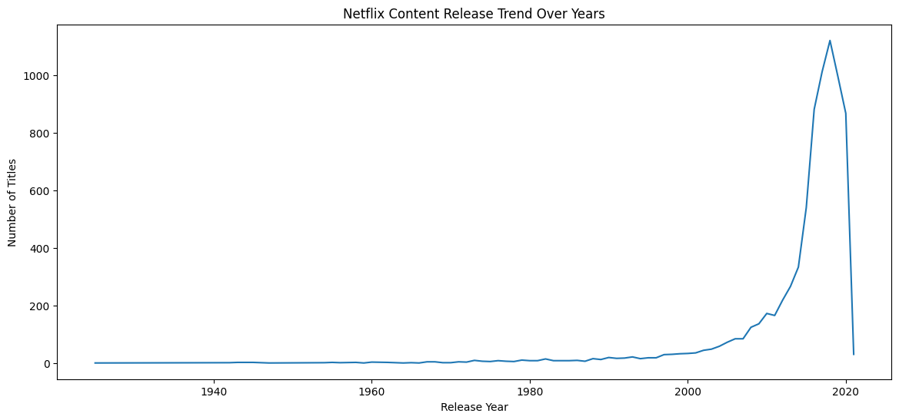
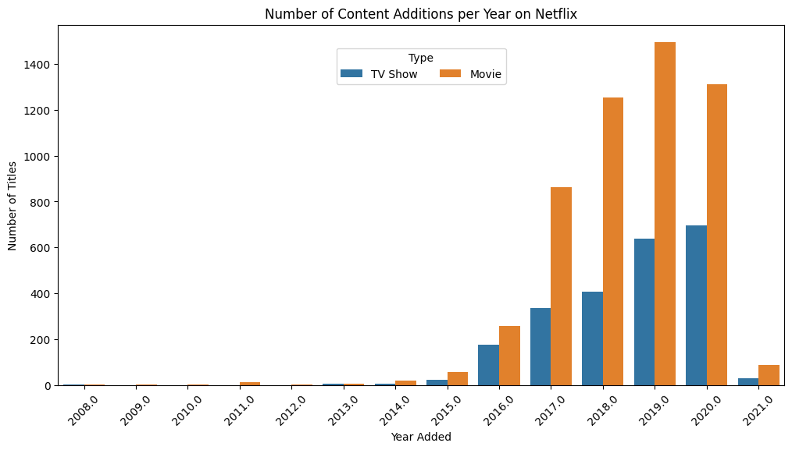
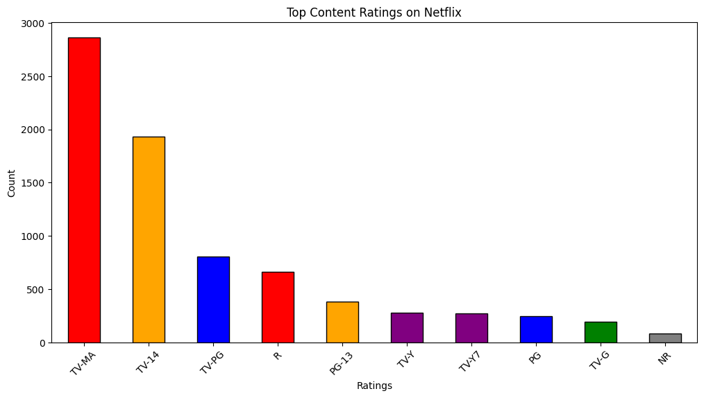
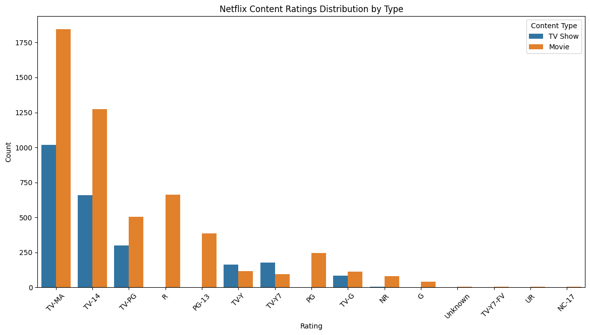
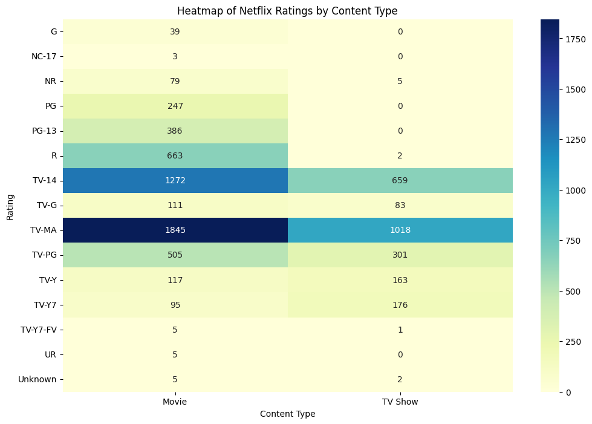
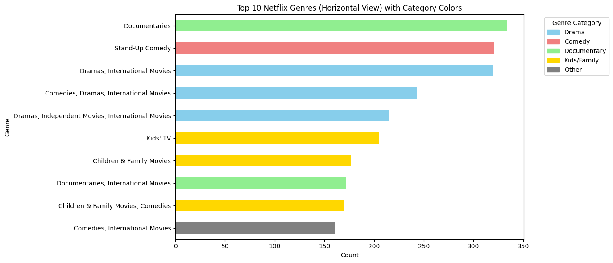

<div align="center">
  <h1>🍿 Netflix Content Analysis (EDA)</h1>
  <p><i>An Exploratory Data Analysis of Netflix Movies and TV Shows</i></p>

  
  
  
  
</div>

---

## 📖 Project Overview
This project focuses on **Exploratory Data Analysis (EDA)** of the Netflix content catalog. By analyzing a dataset of thousands of movies and TV shows, we aim to uncover trends, distribution patterns, and key characteristics of Netflix's offerings.

The analysis is performed using **Python** in a Jupyter/Google Colab Notebook environment, leveraging libraries like `pandas`, `matplotlib`, and `seaborn` for data manipulation and visualization.

### ✨ Key Objectives
- **Content Mix**: Analyze the proportion of Movies vs. TV Shows on the platform.
- **Missing Data Handling**: Identify and clean missing information to ensure data integrity.
- **Geographic Distribution**: Determine the top content-producing countries.
- **Release Trends**: Explore how content releases have evolved over time.
- **Content Ratings**: Understand the distribution of age and content ratings.
- **Genre Popularity**: Identify the most popular genres and categories (`listed_in`).

---

## 📂 Repository Structure

| File | Type | Description |
|------|------|-------------|
| 📓 `Netflix_EDA_Project.ipynb` | Jupyter Notebook (`.ipynb`) | The main interactive notebook containing the full Python code, step-by-step data cleaning, EDA, and visualizations. |
| 📄 `NETFLIX MOVIES AND TV SHOWS CLUSTERING.csv` | CSV Dataset (`.csv`) | The raw dataset used for the analysis containing 7,787 Netflix content records and 12 detailed features (like cast, director, country, release year). |
| 📖 `README.md` | Markdown (`.md`) | Comprehensive documentation for the project, outlining the overview, tech stack, and key insights. |

---

## 🛠️ Tech Stack & Libraries

- **Language:** Python 3
- **Data Manipulation:** `pandas`, `numpy`
- **Data Visualization:** `matplotlib`, `seaborn`
- **Environment:** Google Colab / Jupyter Notebook

---

## 📊 Key Insights & Analytics

### 1. 🔍 Missing Values Analysis
> Identifies columns with significant missing data to guide the data cleaning strategy.



- Missing data found primarily in: `director` (30.6%), `cast` (9.2%), and `country` (6.5%)
- All missing values were imputed with `"Unknown"` to preserve data integrity

---

### 2. 🎬 Movies vs TV Shows Distribution
> A breakdown of Netflix's content catalog by media type.



- **Movies** dominate the Netflix catalog at ~69.6%
- **TV Shows** account for ~30.4%, showing Netflix's film-first strategy

---

### 3. 🌍 Top 10 Countries by Content Volume
> Reveals which countries contribute the most content to Netflix's global library.



- The **United States** is the top content producer by a wide margin
- **India** and the **United Kingdom** follow, reflecting Netflix's push for global diversification

---

### 4. 📅 Netflix Content Release Trend Over Years
> Shows how many titles were released each year, reflecting Netflix's historical output.



- Content production has grown significantly over the decades
- A notable surge is visible from **2015 onwards**, aligning with Netflix's global expansion

---

### 5. 📆 Yearly Content Additions (Movies vs TV Shows)
> Tracks how Netflix has added content year-over-year, split by content type.



- The period **2017–2019** saw the most aggressive content additions
- Both Movies and TV Shows increased steadily, with Movies consistently dominating

---

### 6. 🔞 Top Content Ratings Distribution
> Shows the most common content ratings with color coding based on audience certification.



- **TV-MA** (Mature Audiences) is the most frequent rating, indicating adult-focused content
- **TV-14** and **TV-PG** follow, covering teen and family audiences

---

### 7. 📊 Ratings Distribution by Content Type
> A multivariate view comparing how ratings differ between Movies and TV Shows.



- TV Shows are more likely to be rated **TV-MA** or **TV-14**
- Movies have a broader spread across ratings categories

---

### 8. 🔥 Heatmap: Ratings by Content Type
> A heatmap to visualize the concentration of ratings across Movie and TV Show categories.



- Clearly shows that **TV-MA** dominates for both content types
- Certain ratings like **NC-17** and **UR** appear exclusively or primarily for Movies

---

### 9. 🎭 Top Genres on Netflix
> A breakdown of Netflix's most popular content genres.



- **Dramas**, **Comedies**, and **Documentaries** are the top three genre categories
- Genre diversity reflects Netflix's strategy to appeal to all audience preferences

---

> *(Explore the `Netflix_EDA_Project.ipynb` notebook for the full interactive analysis with code and live visualizations.)*

---

## 📈 Business Outcomes & Conclusion

### Business Outcomes:
- **Content Strategy**: The EDA reveals Netflix's heavy investment in both movies and TV shows, with a slight dominance in movies. This balance suggests a strategy to cater to diverse viewing preferences.
- **Global Production**: The analysis highlights key content-producing countries like the United States, India, and the United Kingdom, indicating a focus on international content to expand global reach and appeal to various cultural audiences.
- **Growth Trends**: The consistent increase in content additions over the years, especially the surge around 2017-2019, shows Netflix's aggressive content acquisition and production strategy during its growth phase.
- **Audience Segmentation**: The distribution of content ratings provides insights into target demographics, with a significant portion of content rated TV-MA and TV-14, catering to mature and young adult audiences, respectively. This informs marketing and content development for specific age groups.
- **Genre Popularity**: Identifying top genres like 'Documentaries', 'Stand-Up Comedy', and various 'Dramas' helps in understanding subscriber preferences and can guide future content investments to maximize engagement.

### Conclusion:
This Exploratory Data Analysis provides a foundational understanding of the Netflix content library, revealing its diverse content mix, global production footprint, and strategic focus on various genres and audience segments. The insights derived from missing value handling, content distribution, and trend analysis are crucial for informed decision-making in content acquisition, production, and marketing, ultimately contributing to a more data-driven content strategy for Netflix.

---

## 🚀 Quick Start

1. Clone this repository to your local machine.
2. Ensure you have the required Python libraries installed:
   ```bash
   pip install pandas numpy matplotlib seaborn
   ```
3. Open `Netflix_EDA_Project.ipynb` in **Jupyter Notebook** or upload it to **Google Colab**.
4. Run all cells to see the step-by-step data cleaning process and generated visualizations.

---

## 👨‍💻 Author

**Rahul Adhikari**
- GitHub: [@ursrahuladhikari](https://github.com/ursrahuladhikari)

<div align="center">
  <i>If you found this analysis insightful, please consider giving the repository a ⭐!</i>
</div>
